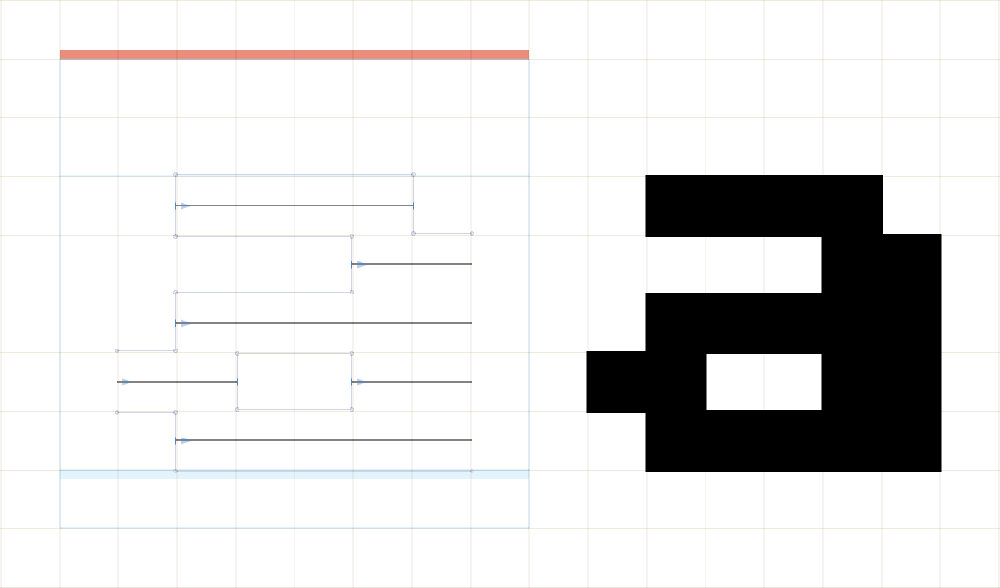
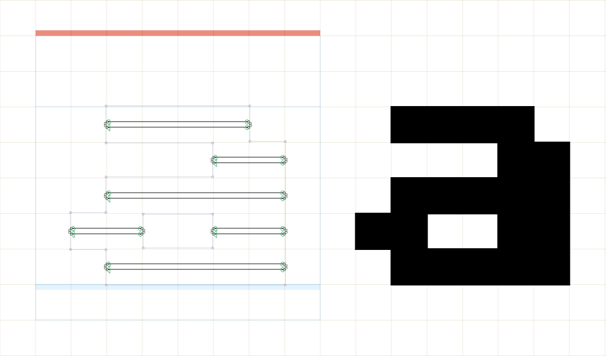
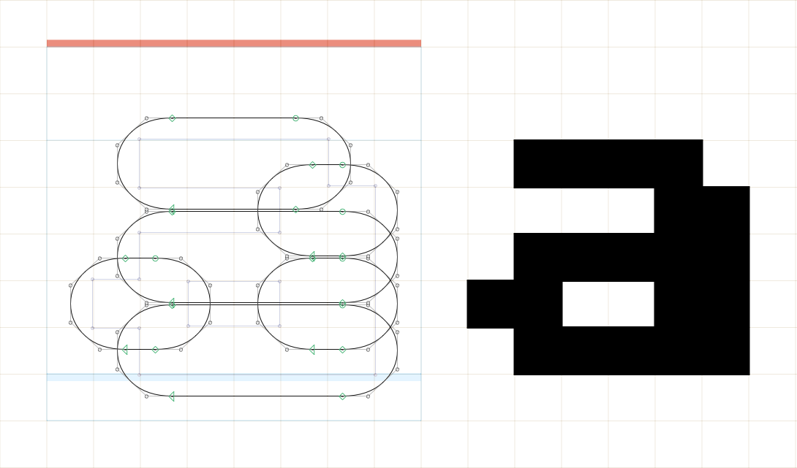
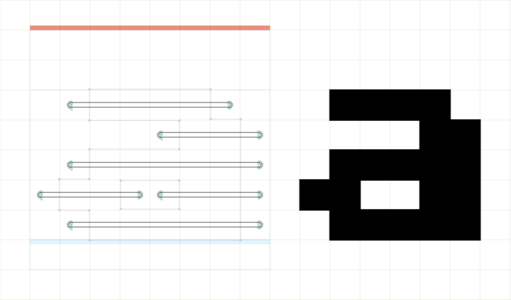
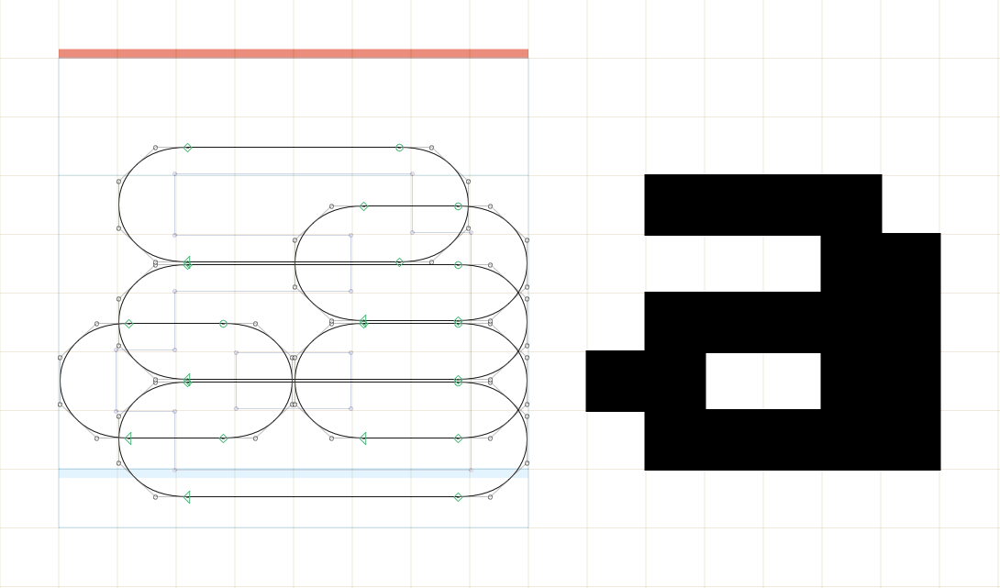
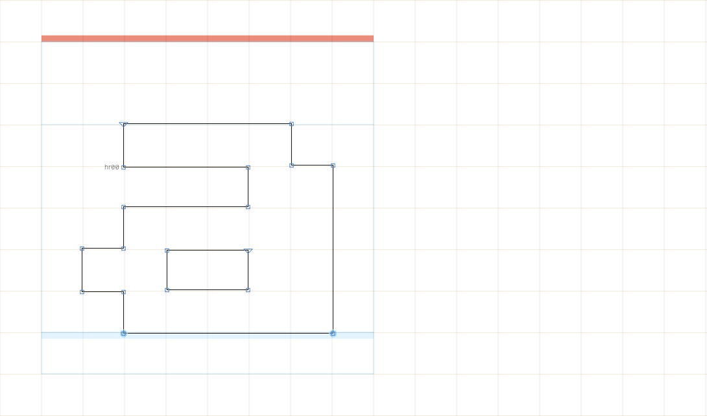

# Notes on the design source files

This folder contains the Glyphs files with masters that are not part of the exported fonts. The files may be of interest if you want to add glyphs or modify the fonts in any other way, as they show the way I developed the variable font from my old pseudo-pixel TrueType font.

For exporting the final fonts, only the Glyphs files in `Sixtyfour/sources` and `Workbench/sources` should be used.

**Master 1** contains horizontal lines with the original pixel drawing in the background. The horizontal lines are derived from master 6 by applying the ‘Hatch’ filter from Glyphs:

Each horizontal line can be 1 to 8 pixels wide. Those lines were then expanded to the actual scan line contours in masters 2 through 5 using the [ExpandPaths.py](../scripts/GlyphsApp/ExpandPaths.py) Glyphs script.

In the production source, those contours are replaced by references to the pixel element glyphs (`pixel.1` to `pixel.8`) in each layer. This saves a lot of file size. The Glyphs script to do this operation is [Componentize.py](../scripts/GlyphsApp/Componentize.py).

**Master 2** has the thinnest scan lines with no bleed to the left or right:

**Master 3** has the thickest scan lines with no bleed. The lines are still extended to the left and right in comparison to master 2 for reasons of optical correction:

**Master 4** has the thinnest scan lines with maximum bleed to the left and right:

**Master 5** has the thickest scan lines with maximum bleed to the left and right:

**Master 6** contains the old outlined pixel font that the reworked font is based on:

The rounded scan line elements in the design source are manually drawn quadratic (TrueType) curves.

In the production source files, those curves are cubic Bézier curves (PostScript curves), because the build process with `fontmake` will try to remove overlaps for static font export, and this is only supported for cubic curves.

So the curves are automatically converted from PostScript to TrueType in the final fonts, which makes them a tiny bit less optimized than the hand-drawn curves here.
