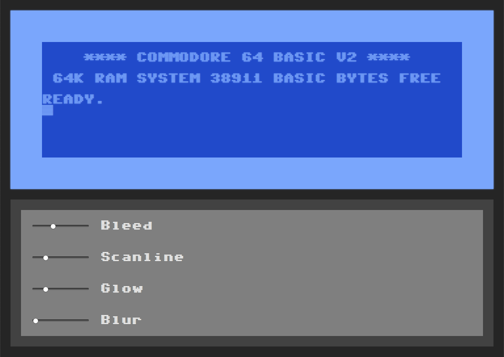
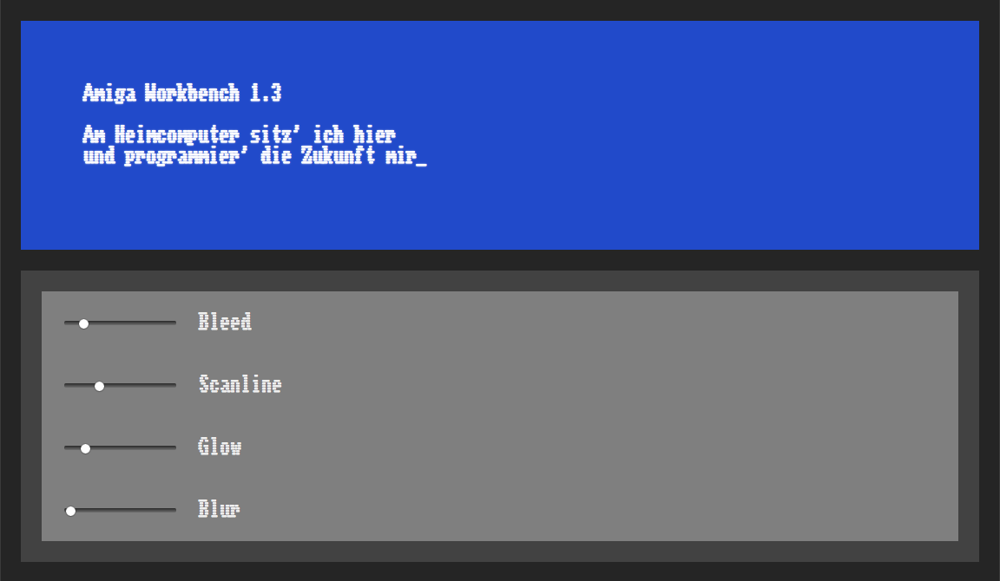

# Homecomputer Fonts

Variable fonts based on the Commodore 64 and Amiga fonts.

Inspired by the article [Raster CRT Typography (According to DEC)](https://www.masswerk.at/nowgobang/2019/dec-crt-typography) by Norbert Landsteiner, I reworked some old pixel versions of the Commodore 64 and Amiga Workbench fonts I had done years ago to include variable font axes for the size of the horizontal scanlines and the amount of horizontal bleed of the pixels due to the phosphor latency found in CRT displays.

The names of the two axes have been translated to standard typographic terms. The scanlines size is controlled by the _weight axis_, while the bleed is controlled by the _width axis._

<figure>
	
	<figcaption>Sixtyfour, check the <a href="https://jenskutilek.github.io/homecomputer-fonts/demo-sixtyfour.html">interactive demo page</a>.</figcaption>
</figure>

<figure>
	
	<figcaption>Workbench, check the <a href="https://jenskutilek.github.io/homecomputer-fonts/demo-workbench.html">interactive demo page</a>.</figcaption>
</figure>

# Building the fonts from source

To use `gftools builder`, I had to [jump through some hoops](https://www.pygit2.org/install.html#libgit2-within-a-virtual-environment) to install pygit2 on macOS.

