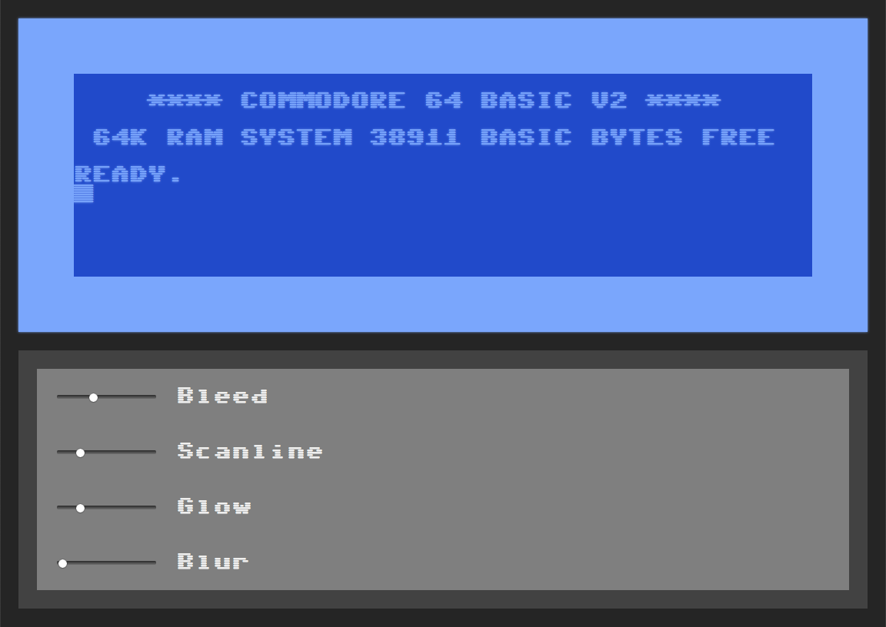
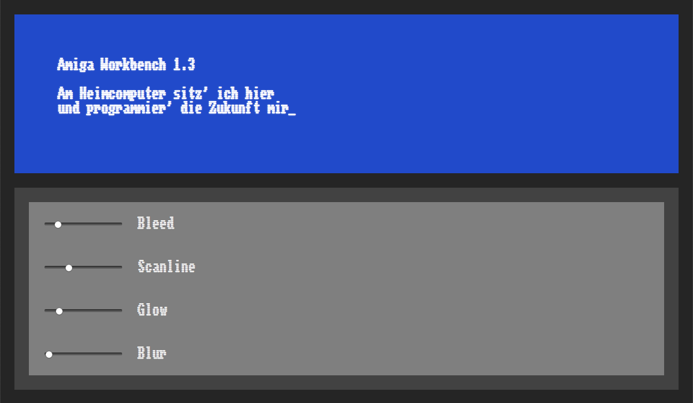

# Homecomputer Fonts (Sixtyfour)

Variable fonts based on the Commodore 64 fonts.

Inspired by the article [Raster CRT Typography (According to DEC)](https://www.masswerk.at/nowgobang/2019/dec-crt-typography) by Norbert Landsteiner, I reworked some old pixel versions of the [Commodore 64 and Amiga Workbench fonts](https://github.com/jenskutilek/homecomputer-fonts) and I had done years ago to include variable font axes for the size of the horizontal scanlines and the amount of horizontal bleed of the pixels due to the phosphor latency found in CRT displays.

<figure>
	
	<figcaption>Sixtyfour, check the <a href="https://jenskutilek.github.io/homecomputer-fonts/demo-sixtyfour.html">interactive demo page</a>.</figcaption>
</figure>

<figure>
	
	<figcaption>Workbench, check the <a href="https://jenskutilek.github.io/homecomputer-fonts/demo-workbench.html">interactive demo page</a>.</figcaption>
</figure>


## Building

Fonts are built automatically by GitHub Actions - take a look in the "Actions" tab for the latest build.

If you want to build fonts manually on your own computer:

To use `gftools builder`, I had to [jump through some hoops](https://www.pygit2.org/install.html#libgit2-within-a-virtual-environment) to install pygit2 on macOS.

Activate the virtual environment:

```bash
source venv/bin/activate
```

When you have got it, you can just type

```bash
make build
make test
make proof
```

## Changelog

## License

This Font Software is licensed under the SIL Open Font License, Version 1.1.
This license is available with a FAQ at
https://scripts.sil.org/OFL

## Repository Layout

This font repository structure is inspired by [Unified Font Repository v0.3](https://github.com/unified-font-repository/Unified-Font-Repository), modified for the Google Fonts workflow.
